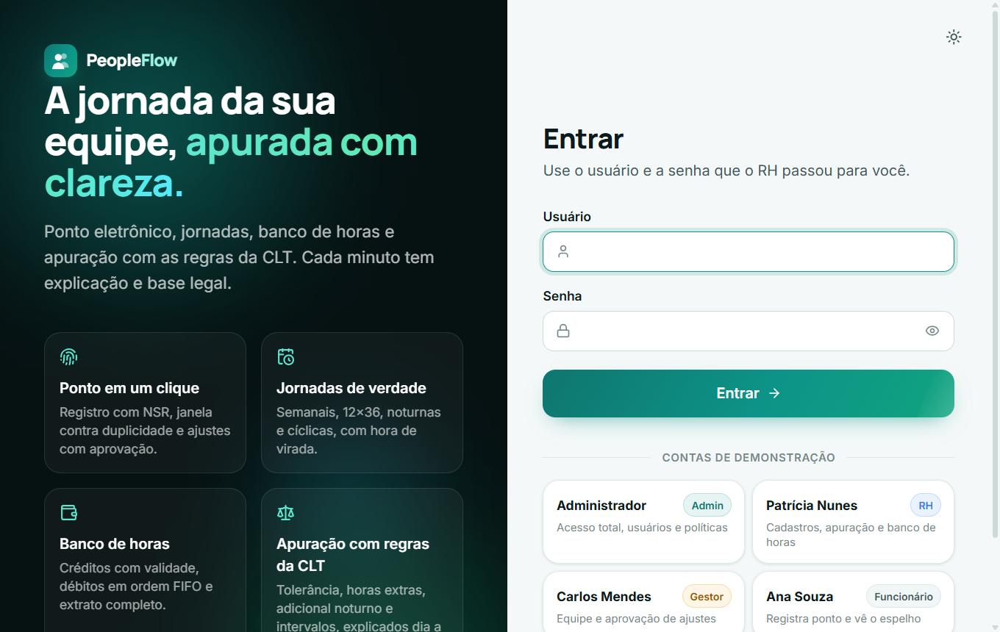
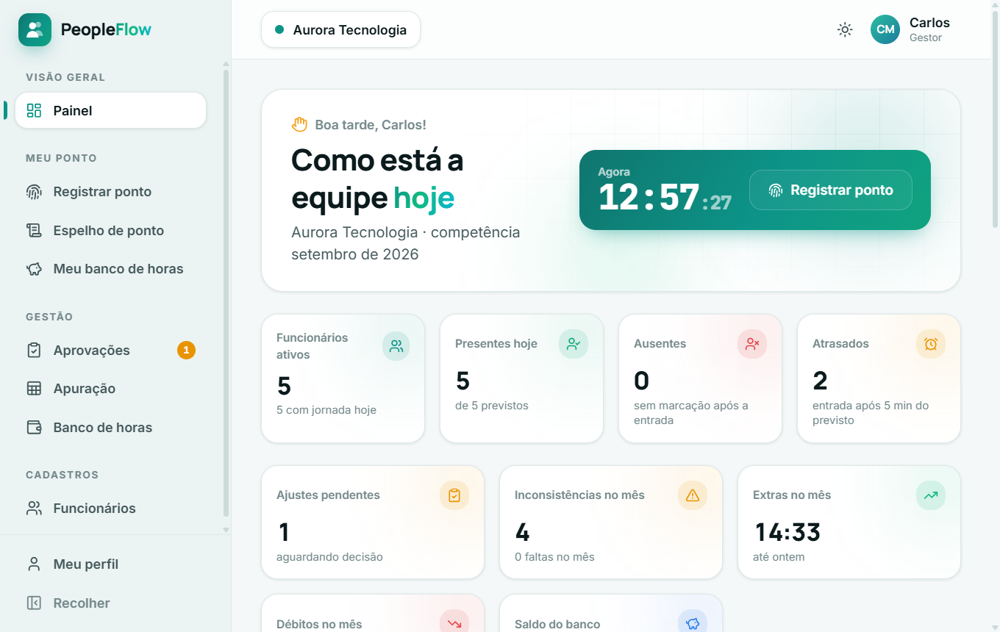
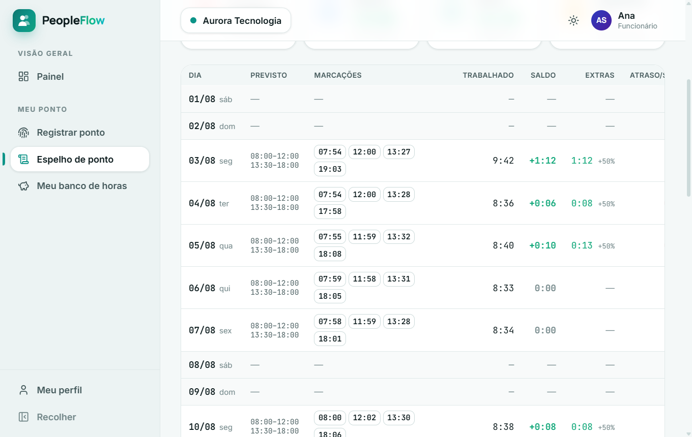
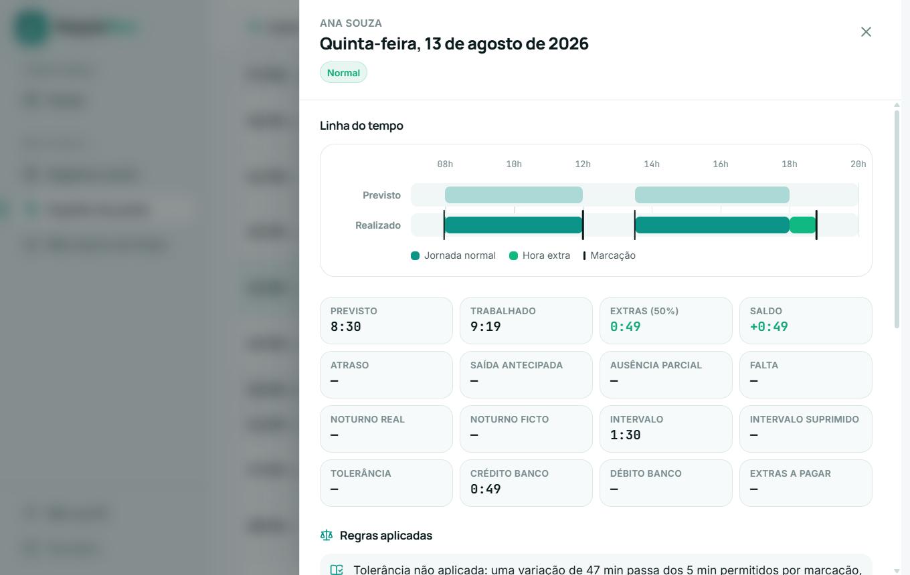
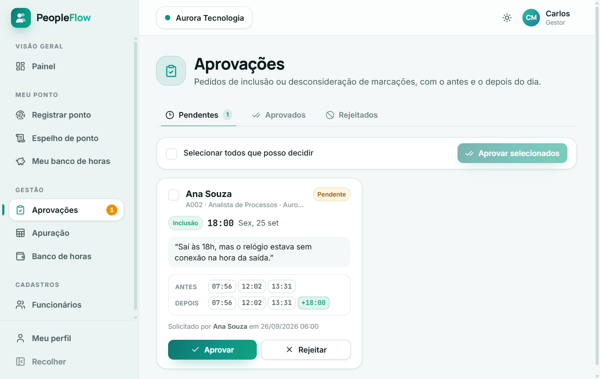
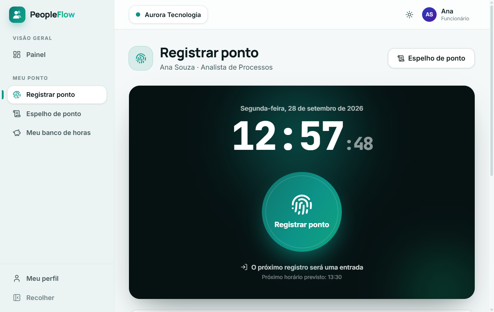
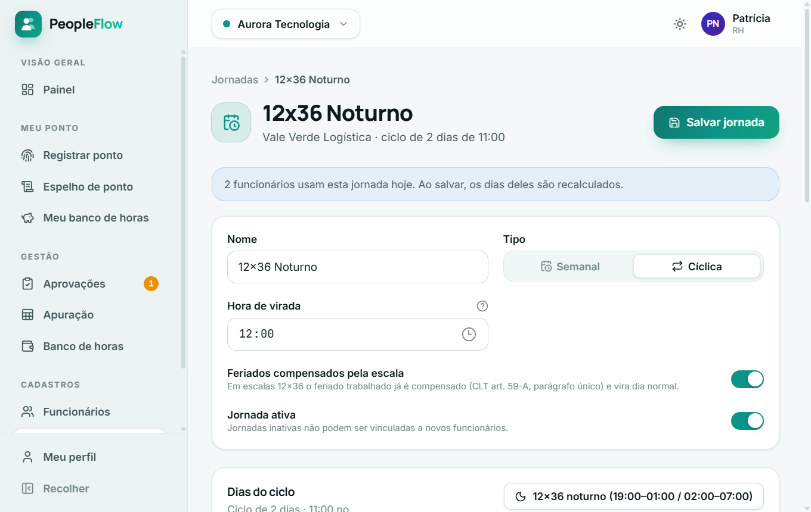
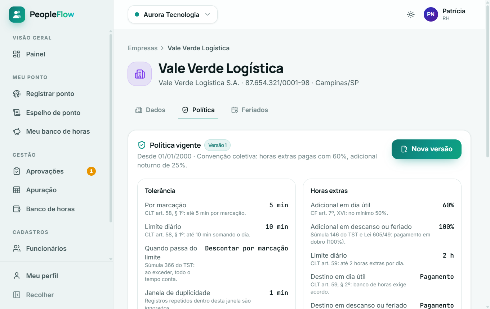
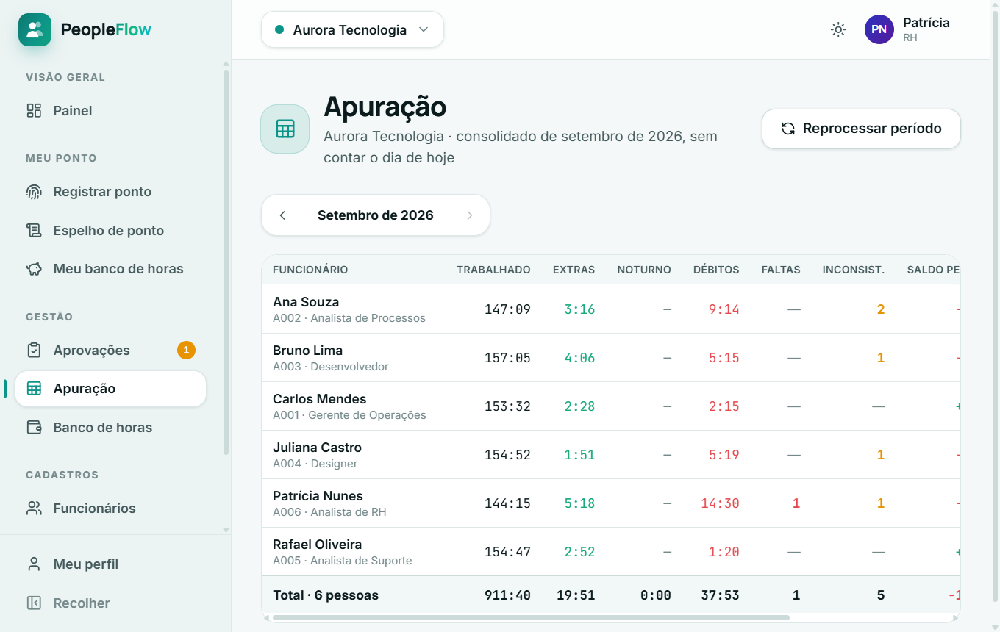

# PeopleFlow

Gestão de pessoas com ponto eletrônico, jornadas, banco de horas e apuração com as regras da CLT. Roda no Windows com janela própria, sem navegador, sem Docker e sem instalar nada à mão.

## O que ele faz

- **Registro de ponto** com relógio do servidor, NSR sequencial e ajustes (inclusão ou desconsideração) que precisam da aprovação de outra pessoa.
- **Jornadas semanais e escalas** (12x36 com equipes alternadas, 6x1, turnos noturnos que viram a meia-noite).
- **Motor de apuração** puro e testado: tolerância (CLT art. 58 §1º e Súmula 366), hora extra por tipo de dia, adicional noturno com hora reduzida e prorrogação, intervalo e interjornada, banco de horas com vencimento em FIFO.
- **Políticas por empresa, versionadas por vigência**: a mesma marcação dá resultados diferentes conforme a regra de cada empresa, e o passado continua calculável com a regra da época.
- **Espelho de ponto explicado**: cada dia mostra a linha do tempo previsto × realizado e as regras aplicadas com a base legal.
- **Perfis** Admin, RH, Gestor e Funcionário, com escopo de dados e auditoria de quem fez cada alteração.

## Telas

| | |
|---|---|
|  |  |
| **Login** com as contas de demonstração | **Painel** com presença do dia e indicadores do mês |
|  |  |
| **Espelho de ponto** com marcações, saldo e extras | **Detalhe do dia**: previsto × realizado e regras aplicadas |
|  |  |
| **Aprovações** com o antes e o depois do dia | **Registrar ponto** com relógio e apuração parcial |
|  |  |
| **Jornada 12x36** noturna com hora de virada | **Política** versionada, com a base legal de cada regra |



## Como abrir

```
publish.cmd
```

Gera a release em `release\PeopleFlow` e cria o atalho **PeopleFlow** na área de trabalho. Se a máquina não tiver .NET SDK 10 ou Node 22, o script baixa sozinho para `.tools\`. Na primeira abertura o banco é criado com duas empresas de demonstração; as contas de acesso aparecem na tela de login.

Desenvolvimento: `dev.ps1` (API + Vite no navegador) ou `dev.ps1 -ComJanela`.

## Tecnologia

| Camada | Stack |
|---|---|
| Janela | WinForms + WebView2, Kestrel no mesmo processo |
| Backend | .NET 10, ASP.NET Core, EF Core 10 + SQLite, FluentValidation, Serilog |
| Frontend | React 19, TypeScript, Vite, Tailwind CSS 4, TanStack Query, Motion |
| Testes | xUnit no motor de apuração |

```
Frontend (React) ── REST ──> API ──> Application ──> Domain (motor de apuração puro)
                                         │
                                  Infrastructure (SQLite, auditoria, seed)
```

Documentação completa em `docs/`.
